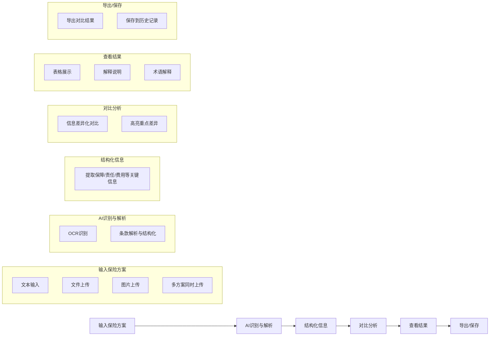

# 保险方案对比 AI 小程序 PRD

## 1. 产品定位

### 目标
帮助普通用户快速看懂重疾险、百万医疗险等保险方案之间的差异，解决条款复杂、专业术语多、难以对比的问题。

### 我们做什么
- ✅ 条款解析与结构化
- ✅ 信息抽取与整理
- ✅ 多方案差异对比
- ✅ 重点差异高亮与解释
- ✅ 术语白话解释
- ✅ 支持导出对比结果

### 我们不做什么
- ❌ 产品推荐或排序
- ❌ 购买建议或方案规划
- ❌ 投资收益预测
- ❌ 代替保险顾问
- ❌ 任何营销或导流行为

---

## 2. 支持险种（首期）

| 险种 | 覆盖范围 |
|------|----------|
| 重疾险 | 覆盖重疾/中症/轻症/身故；豁免等核心责任 |
| 百万医疗险 | 覆盖一般医疗/重疾医疗，免赔额/续保等核心责任 |

---

## 3. 核心流程



---

## 4. 页面结构

### 4.1 首页（方案输入页）

| 区域 | 元素 | 功能说明 |
|------|------|----------|
| 顶部 | 标题栏 | 保险方案对比AI |
| 输入区 | 文本输入卡片 | 支持粘贴保险条款文本 |
| 输入区 | 文件上传卡片 | 支持PDF/Word/Excel/TXT |
| 输入区 | 图片上传卡片 | 支持多图/多页图片自动识别 |
| 底部 | 开始对比按钮 | 显示已选方案数量 |
| 底部 | 免责声明 | 全局固定展示 |
| 导航 | 首页/历史/我的 | 底部tab栏 |

### 4.2 分析进度页

| 区域 | 元素 | 功能说明 |
|------|------|----------|
| 内容区 | 进度标题 | 正在分析保险方案... |
| 内容区 | 进度列表 | 显示各步骤完成状态 |
| 内容区 | 进度条 | 整体进度百分比 |
| 内容区 | 预计剩余时间 | 动态倒计时 |
| 底部 | 免责声明 | 全局固定展示 |

### 4.3 对比结果页

| 区域 | 元素 | 功能说明 |
|------|------|----------|
| 顶部 | Tab切换 | 对比表格 / 关键差异 |
| 内容区 | 对比表格 | 横向对比各方案信息 |
| 底部 | 导出结果按钮 | 导出PDF |
| 底部 | 保存到历史按钮 | 保存记录 |
| 底部 | 免责声明 | 全局固定展示 |

### 4.4 关键差异说明页

| 区域 | 元素 | 功能说明 |
|------|------|----------|
| 顶部 | Tab切换 | 对比表格 / 关键差异 |
| 内容区 | 差异卡片列表 | 按类别分组展示 |
| 内容区 | 差异标签 | 有利/不利/一般/相同 |
| 底部 | 免责声明 | 全局固定展示 |

---

## 5. 功能模块结构

```mermaid
graph TD
    A[保险对比小程序] --> B[方案输入]
    A --> C[方案管理]
    A --> D[AI解析]
    A --> E[对比分析]
    A --> F[结果展示]
    A --> G[导出与分享]
    A --> H[历史记录]
    A --> I[我的]
    
    B --> B1[文本输入]
    B --> B2[文件上传]
    B --> B3[图片上传]
    
    C --> C1[方案列表]
    C --> C2[方案预览]
    C --> C3[删除/重命名]
    
    D --> D1[OCR识别]
    D --> D2[条款解析与结构化]
    D --> D3[信息抽取]
    
    E --> E1[多方案对比]
    E --> E2[差异识别与高亮]
    E --> E3[解释生成]
    
    F --> F1[对比表格]
    F --> F2[关键差异说明]
    F --> F3[术语解释]
    
    G --> G1[导出PDF]
    G --> G2[分享图片]
    G --> G3[保存到历史]
    
    H --> H1[历史对比列表]
    H --> H2[查看对比详情]
    H --> H3[删除记录]
    
    I --> I1[用户设置]
    I --> I2[隐私与协议]
```



---

## 6. 对比维度（固定边界，用户不可自定义）

### 6.1 基础信息
| 字段 | 说明 |
|------|------|
| 保险公司 | 方案所属保险公司 |
| 产品名称 | 保险产品全称 |
| 保险类型 | 重疾险/百万医疗险 |
| 保障期限 | 保至70岁/终身等 |
| 保障期限 | 保至70岁/终身等 |
| 缴费期限 | 20年/30年等 |
| 等待期 | 90天/180天等 |

### 6.2 核心保障（重疾险）
| 字段 | 说明 |
|------|------|
| 重疾种类 | 保障重疾数量 |
| 重疾赔付比例 | 基本保额百分比 |
| 重疾赔付次数 | 累计赔付次数 |
| 中症保障 | 中症赔付相关 |
| 轻症保障 | 轻症赔付相关 |
| 身故保障 | 身故责任 |
| 被保人豁免 | 豁免条款 |
| 投保人豁免 | 投保人豁免条款 |

### 6.3 核心保障（百万医疗险）
| 字段 | 说明 |
|------|------|
| 一般医疗保额 | 年度/终身限额 |
| 重疾医疗保额 | 重疾专项保额 |
| 免赔额 | 年度免赔金额 |
| 报销范围 | 社保内/外等 |
| 报销比例 | 报销百分比 |
| 医院范围 | 就诊医院限制 |
| 住院前后门急诊 | 前后天数 |
| 特殊门诊 | 门诊手术等 |
| 门诊手术 | 相关保障 |
| 续保条件 | 续保规则 |

### 6.4 费用相关
| 字段 | 说明 |
|------|------|
| 年保费 | 按费率计算 |
| 保费测算条件 | 年龄/性别等 |

### 6.5 限制与免责
| 字段 | 说明 |
|------|------|
| 免责条款数量 | 免责项数 |
| 免责条款重点 | 关键免责内容 |
| 健康告知要点 | 健康要求 |
| 职业限制 | 职业类别限制 |
| 年龄限制 | 投保年龄范围 |
| 等待期内疾病处理 | 等待期内患病规则 |

### 6.6 增值服务（如有）
| 字段 | 说明 |
|------|------|
| 就医绿通 | 绿色通道服务 |
| 住院垫付 | 费用垫付服务 |
| 特药服务 | 特效药服务 |
| 质子重离子 | 相关保障 |
| 其他增值服务 | 其他服务 |

---

## 7. 差异高亮规则

| 标签 | 颜色 | 含义 | 示例 |
|------|------|------|------|
| 有利 | 绿色 | 方案A优于方案B | 方案A重疾种类(130种) > 方案B(120种) |
| 不利 | 红色 | 方案A劣于方案B | 方案B赔付次数(3次) < 方案A(4次) |
| 一般 | 黄色 | 存在差异，影响中性 | 中症赔付比例不同 |
| 相同 | 灰色 | 方案一致 | 等待期均为90天 |

---

## 8. 合规模块（必备）

| 项目 | 要求 |
|------|------|
| 全局免责声明 | 每页显示 |
| 结果免责声明 | 结果页突出展示 |
| 导出文件免责声明 | 导出内容包含 |
| 禁止出现推荐/购买建议语句 | 全流程禁止 |
| 敏感词过滤 | 推荐/排名/最优等 |

**免责声明内容：**
> 本工具仅供保险方案信息提取与差异化对比，不提供任何保险推荐、购买建议或收益预测。最终决策请以正式保险合同及专业保险顾问意见为准。

---

## 9. 数据与技术架构

### 9.1 前端（微信小程序）

| 模块 | 技术选型 |
|------|----------|
| UI层 | Taro / Uni-app |
| 可维护可复用组件化 | 自定义组件 |
| 状态管理 | Pinia/Redux |
| UI组件库 | 自定义 |
| 状态管理 | 自定义 |
| 接口层 | API封装 |

### 9.2 后端服务（云函数/Node.js）

| 模块 | 功能 |
|------|------|
| 文件接收与存储 | COS |
| 任务队列 | 处理异步任务 |
| OCR服务 | 多页图片识别 |
| AI解析服务 | LLM调用 |
| 对比分析服务 | 差异计算 |

### 9.3 数据存储（数据库）

| 表名 | 存储内容 |
|------|----------|
| 方案信息表 | 保险方案基础信息 |
| 解析结果表 | AI解析结构化数据 |
| 对比结果表 | 对比分析结果 |
| 用户信息表 | 用户基本信息 |
| 操作日志表 | 操作记录 |

### 9.4 AI能力

| 能力 | 用途 |
|------|------|
| OCR | 图片识别 |
| 条款解析(LLM) | 条款结构化 |
| 差异分析(LLM) | 对比分析 |
| 信息抽取(结构化) | 关键信息提取 |
| 术语解释(LLM) | 白话解释 |

---

## 10. 非功能需求

| 指标 | 要求 |
|------|------|
| 识别准确率 | 90%（清晰图片） |
| 支持方案数 | 2-6份方案一次对比 |
| 单次文件大小 | ≤20MB |
| 响应时间 | 解析完成≤60秒 |
| 数据安全 | 加密存储，用户隐私保护 |
| 兼容性 | 兼容主流机型与系统 |

---

## 11. API 接口规范

### 11.1 上传文件接口

**POST /api/upload**

| 参数 | 类型 | 必填 | 说明 |
|------|------|------|------|
| file | File | 是 | 上传的文件 |
| type | String | 是 | file/image/text |
| fileName | String | 是 | 文件名 |

**返回：**
```json
{
  "code": 200,
  "data": {
    "fileId": "string",
    "uploadUrl": "string"
  }
}
```

### 11.2 开始解析接口

**POST /api/analyze**

| 参数 | 类型 | 必填 | 说明 |
|------|------|------|------|
| fileIds | Array | 是 | 文件ID列表 |

**返回：**
```json
{
  "code": 200,
  "data": {
    "taskId": "string",
    "status": "processing"
  }
}
```

### 11.3 查询解析进度接口

**GET /api/task/{taskId}**

**返回：**
```json
{
  "code": 200,
  "data": {
    "taskId": "string",
    "status": "processing/complete/failed",
    "progress": 72,
    "estimatedTime": 20,
    "steps": [
      {"name": "文件解析", "status": "completed"},
      {"name": "OCR识别", "status": "completed"},
      {"name": "条款解析", "status": "completed"},
      {"name": "信息抽取", "status": "completed"},
      {"name": "差异分析", "status": "processing"}
    ]
  }
}
```

### 11.4 获取对比结果接口

**GET /api/compare/{taskId}**

**返回：**
```json
{
  "code": 200,
  "data": {
    "taskId": "string",
    "plans": [
      {
        "planId": "string",
        "fileName": "string",
        "basicInfo": {...},
        "coverage": {...},
        "cost": {...},
        "exclusions": {...},
        "services": {...}
      }
    ],
    "differences": [
      {
        "category": "string",
        "field": "string",
        "items": [
          {"planId": "string", "value": "string", "advantage": "better/worse/same/neutral"}
        ],
        "summary": "string"
      }
    ]
  }
}
```

### 11.5 导出结果接口

**POST /api/export**

| 参数 | 类型 | 必填 | 说明 |
|------|------|------|------|
| taskId | String | 是 | 任务ID |
| format | String | 是 | pdf/image |

**返回：**
```json
{
  "code": 200,
  "data": {
    "url": "string",
    "expireTime": "string"
  }
}
```

### 11.6 保存到历史接口

**POST /api/history/save**

| 参数 | 类型 | 必填 | 说明 |
|------|------|------|------|
| taskId | String | 是 | 任务ID |
| name | String | 否 | 自定义名称 |

**返回：**
```json
{
  "code": 200,
  "data": {
    "historyId": "string"
  }
}
```

### 11.7 获取历史列表接口

**GET /api/history**

**返回：**
```json
{
  "code": 200,
  "data": [
    {
      "historyId": "string",
      "name": "string",
      "planCount": 3,
      "createTime": "string",
      "taskId": "string"
    }
  ]
}
```

---

## 12. 版本计划（MVP 1.0）

| 阶段 | 功能 | 状态 |
|------|------|------|
| 1 | 方案输入（文本/文件/图片） | 开发中 |
| 2 | 多方案解析与对比 | 开发中 |
| 3 | 对比表格 + 关键差异 | 待开发 |
| 4 | 术语解释 | 待开发 |
| 5 | 导出与历史记录 | 待开发 |
| 6 | 免责声明与合规展示 | 待开发 |

---

## 13. 验收标准

### 功能验收
1. ✅ 支持文本、PDF、Word、Excel、TXT、图片多格式输入
2. ✅ 支持2-6份方案同时对比
3. ✅ OCR识别准确率≥90%（清晰图片）
4. ✅ 解析完成时间≤60秒（单份方案）
5. ✅ 差异对比结果准确，高亮标签正确
6. ✅ 支持导出PDF格式对比报告
7. ✅ 支持保存历史记录
8. ✅ 每页显示免责声明

### UI验收
1. ✅ 小程序风格简洁，交互流畅
2. ✅ 对比表格清晰可读
3. ✅ 差异标签颜色区分明显（绿/红/黄/灰）
4. ✅ 响应式设计，适配不同屏幕

### 合规验收
1. ✅ 无推荐/排名/最优等敏感词
2. ✅ 导出文件包含免责声明
3. ✅ 用户数据加密存储

---

## 14. 后续迭代规划

| 功能 | 说明 | 优先级 |
|------|------|--------|
| 更多险种扩展 | 支持意外险、寿险等 | 中 |
| 对比维度可选 | 用户自定义对比维度 | 中 |
| 保单条款片段定位 | 点击差异跳转到条款原文 | 高 |
| 智能问答 | 基于条款的问答服务 | 低 |